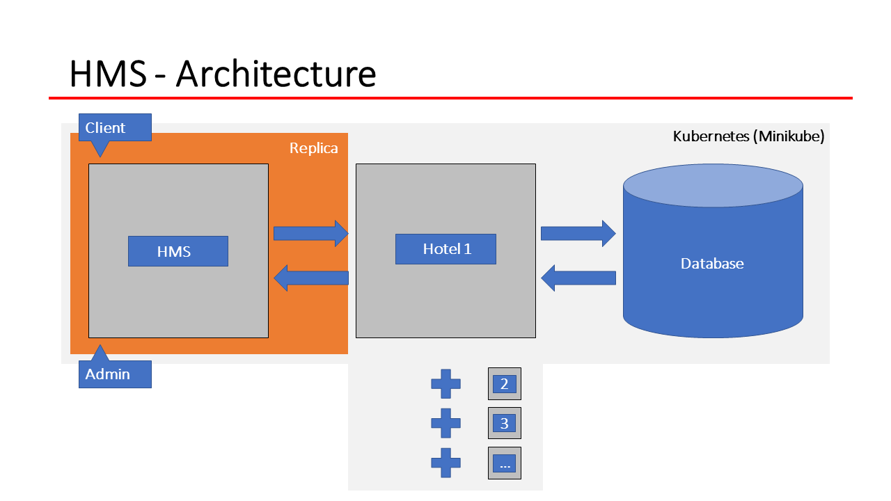
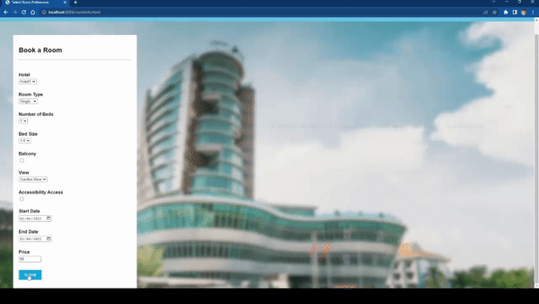
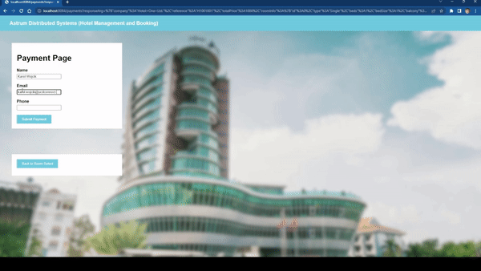
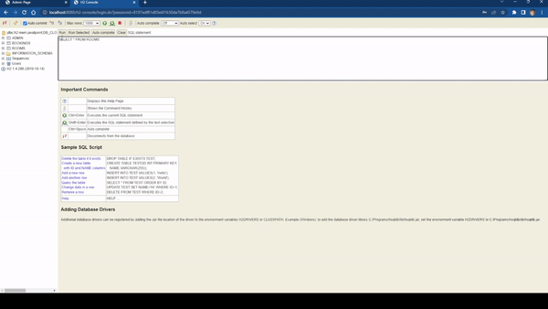
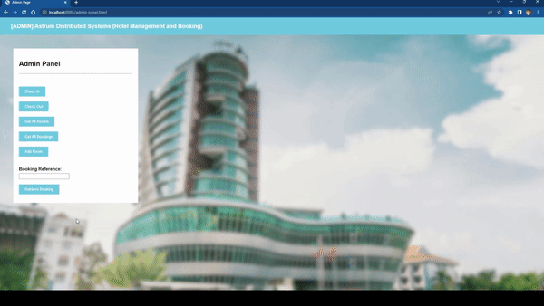

# Hotel Management and Booking System

The Hotel Management System is a distributed application designed to manage hotel operations efficiently as well as facilitate guest room booking. 

It provides features such as quote generation, room booking, customer management, and reservation tracking. This system helps streamline hotel operations, enhance guest experiences, and improve overall efficiency through distributed systems best practices.

***

#### Project Information
**Team Name:** Astrum Distributed Systems\
**Team Number:** 3

- Karol Wojcik (18322146)
- Peter O'Riordan (18749619)
- Ross Murphy (20207271)

#### Requirements
- **Technical Requirements:** The project goes beyond the course's scope by leveraging Minikube with Kubernetes Load Balancer, expanding its technical capabilities. With Kubernetes as the container orchestration platform, the hotel management system can be deployed and managed across multiple nodes or clusters. The Load Balancer plays a crucial role in efficiently distributing incoming traffic to the system's backend services, resulting in improved scalability and fault tolerance.
- **Design Considerations:** The hotel management system can benefit from distribution due to several factors. Firstly, distributing the system allows for better fault tolerance, as multiple instances of the application can be deployed across different nodes or clusters. If one instance fails, the load balancer can route traffic to other healthy instances, ensuring high availability. Additionally, distribution enables scalability, allowing the system to handle increasing user demands by adding or removing instances as needed.
- **Solution Quality:** The project follows best practices in utilizing various technologies. It leverages Spring Boot, a popular Java framework, for developing the web application, which promotes modularity and ease of development. The use of an in-memory H2 database provides efficient data storage and retrieval. The incorporation of Minikube with Kubernetes Load Balancer demonstrates a modern approach to distributed systems, leveraging containerization and orchestration for scalability, fault tolerance, and easier deployment.
- **Report & Video:** The project's report and video showcase an excellent reflection on the pros and cons of the chosen approach. The report highlights the advantages of using distributed technologies like Kubernetes Load Balancer, such as improved fault tolerance, scalability, and simplified deployment. It also addresses any potential drawbacks or challenges encountered during the implementation and provides insights into mitigating those issues. The video presentation effectively communicates these points and demonstrates the functionality and benefits of the hotel management system.

## Features

- **Room management:** Add, update, and delete rooms with details such as room type, bed size, balcony availability, etc.
- **Booking management:** Create and manage room bookings, including check-in and check-out dates, customer details, and pricing.
- **Customer management:** Maintain customer records, including their name, email, and phone number.
- **Availability tracking:** Track room availability based on check-in and check-out dates.
- **Billing and invoicing:** Generate invoices for bookings and calculate pricing based on room type and duration of stay in addition to other factors.
- **Kubernetes (Load Balancer):** Utilize Kubernetes Load Balancer feature to efficiently distribute incoming traffic to the backend services of the hotel management system, ensuring scalability and fault tolerance. This feature enhances the system's ability to handle high volumes of requests and provides reliable load balancing capabilities across multiple instances or clusters.
## Project Architecture

## Technologies Used

- **Java:** Programming language used for backend development.
- **REST:** Architectural style that allows for standardized communication between client and server through the use of HTTP methods and resource-based URLs.
- **Spring Boot:** Framework used for developing the web application.
- **H2 Database:** In-memory database used for storing room and booking data.
- **Docker:** A platform that enables the creation, deployment, and running of applications in lightweight and isolated containers.
- **Kubernetes (Minikube):** A container orchestration tool that automates the management, scaling, and deployment of containerized applications.
- **JavaScript:** A programming language commonly used to add interactivity and dynamic functionality to web pages.
- **HTML/CSS:** Frontend technologies used for creating user interfaces.
- **GitLab:** Version control system used for collaboration and code management.
## Prerequisites

- **Docker Desktop (version 4.16.3 (96739) or higher):**  [**Install Here**](https://docs.docker.com/desktop/install/windows-install/)
- **Git (version 2.39.1.windows.1):** [**Install Here**](https://git-scm.com/book/en/v2/Getting-Started-Installing-Git)
- **Apache Maven (version 3.8.7):** [**Install Here**](https://maven.apache.org/install.html)
- **Java JDK (version 1.8.0_202):** [**Install Here**](https://www.oracle.com/ie/java/technologies/javase/javase8-archive-downloads.html)
- **Minikube (version 1.30.1):** [**Install Here**](https://minikube.sigs.k8s.io/docs/start/)
- **IDE (e.g. VScode):** [**Install Here**](https://code.visualstudio.com/download)

## Installation Guide

Upon successfull inistallation of the "Prerequisites" clone the repository from GitLab.

`git clone https://gitlab.com/ucd-cs-rem/comp30220-2023/astrum-distributed-systems.git`
## How to Run?

#### Docker Application

**Make sure to have Docker Desktop running before attempting to run this application.*

Once the application has been successfully cloned you can run it using the following commands by first acessing them in the BASHscripts folder. In the root directory type the following:

`cd .\BASHscripts\`

Then execute the following script which to install core in the VScode IDE (Git Bash Terminal).

`mvn clean install core`

Following this you can build the astrumBuildAndRun.sh which will compile, package and docker compose up the applicaiton.

`chmod u+x astrumBuildAndRun.sh`

After building the shell script you can run it usnig the following command:

`./astrumBuildAndRun`

***

#### Kubernetes (Minikube)

**Make sure to have Docker Desktop running before attempting to run this application.*
Start minikube:

`minikube start`

Navigate to the Bash sciprts directory (once in root directory) within the application and build the following script:

`cd .\BASHscripts\`

Build the script with the following command:

`chmod u+x kubernetesDeploy.sh`

Run the script with the following command:

`./kubernetesDeploy`

Wait for the pods to be ready:

`kubectl get pods`

Once all the pods are ready, we need to port forward each of the services:

`kubectl port-forward service/admin 8085:80`\
`kubectl port-forward service/client 8084:80`\
`kubectl port-forward service/hms 8083:80`\
`kubectl port-forward service/hotel 8080:80`

***

#### Additional Information
- **Accessing the Application: http://localhost:8083/home.html**
    

- **Accessing the H2 Database: http://localhost:8080/h2-console**

- **Logging into the H2 Database:**
    - JDBC URL = jdbc:h2:mem:javatpoint;DB_CLOSE_DELAY=-1;DB_CLOSE_ON_EXIT=FALSE
    - username = sa
    - password = password
    

- **Logging in as Admin:**
    - username = admin
    - password = admin
## How it Works?

**Client**

#### Requesting a Booking

#### Recieving Quotes

#### Making a Payment and Confirming a Boooking

**H2 Database**

#### Checking H2 Database Content

**Admin**

#### Viewing All Bookings

#### Adding and Removing Rooms

#### Check-In and Check-Out

## Project Report

The project demontration video can be accessed in this repository and viewed here: [**Access Here**](report/COMP30220_Assignment_2_Group_Project_Astrum_Distributed_Systems_Report.pdf)
## Project Demonstration

The project demontration video can be viewed here (private YouTube video): [**Access Here**](https://YouTube.com)
## FAQs

**Q) How do I book a room?**\
A) You can book a room simply by interacting through the client portal and inputting the desired booking information to recieve a list of available rooms within the hotel.

**Q) How does the Kubernetes Load Balancer feature benefit the hotel management system?**\
A) The Kubernetes Load Balancer feature ensures efficient distribution of incoming traffic to the backend services of the hotel management system. It enhances scalability and fault tolerance, enabling the system to handle a high volume of requests and provide reliable load balancing across multiple instances or clusters.

**Q) Can this project be scaled up?**\
A) Yes, the hotel management project is designed to be scalable. It can handle an increasing number of rooms, bookings, and customers without significant performance degradation. The use of technologies like Docker and Kubernetes (where each service is dockerized and deployed) allows for easy deployment and management of the application across multiple nodes or clusters, enabling horizontal scaling. Additionally, the system architecture follows best practices to ensure scalability, such as modular and decoupled components that can be independently scaled as needed.

**Q) Does the hotel management system support multiple customers?**\
A) Yes, the system supports multiple customers. In the "Customer Management" section, you can maintain records of various customers, including their names, email addresses, and phone numbers. This allows you to associate bookings with specific customers and manage their information efficiently.

**Q) How are billing and pricing calculated for room bookings?**\
A) Billing and pricing for room bookings are calculated dynamically based on various factors such as the room type, duration of stay, additional services, and any applicable discounts. The system uses these parameters to generate invoices accurately, reflecting the total cost of the booking.

**Q) Can I view the list of all existing rooms in the hotel management system?**\
A) Yes, you can view the list of all existing rooms by accessing the "Room Management" section by logging in as an Admin. It will display a comprehensive list of rooms along with their details such as room type, bed size, balcony availability, and more.

**Q) Is it possible to integrate the hotel management system with other third-party applications or services?**\
A) Yes, the hotel management system offers integration capabilities through APIs (Application Programming Interfaces). You can integrate it with other applications or services such as online booking platforms, payment gateways, or property management systems to streamline operations and enhance functionality.

**Q) Is it possible to check the availability of a specific room for a future date?**\
A) Yes, you can check the availability of a specific room by selecting the desired room and entering the check-in and check-out dates in the booking form. The system will display the availability status accordingly.

**Q) Can I make a booking without providing my personal information?**\
A) No, providing personal information such as name, email, and phone number is necessary for making a booking. This information is required for communication and reservation purposes.

**Q) What are the biggest advantages of this application?**\
A) One of the biggest advantages of this application is its comprehensive room and booking management system, which allows for easy management of room inventory, bookings, and customer information. The application also offers real-time availability tracking, ensuring accurate booking information and minimizing the risk of overbooking. Additionally, the integration of a load balancer in the Kubernetes environment provides scalability and fault tolerance, allowing the application to handle increased traffic and ensure a seamless experience for users.

**Q) What are the biggest drawbacks of this application?**\
A) While the application offers various benefits, one technical drawback related to the implementation is the increased complexity introduced by the distributed systems architecture. The integration of distributed technologies like Docker and Kubernetes requires a deeper understanding of containerization, orchestration, and networking concepts. It may involve additional configuration steps and troubleshooting to ensure proper communication and synchronization between different components across multiple nodes or clusters. However, the project provides comprehensive documentation and support to assist users in navigating these challenges and maximizing the advantages of the distributed systems approach.
## Acknowledgements

 - [COMP30220 Distributed Systems Professor Rem Collier](https://people.ucd.ie/rem.collier)
 - [Spring REST Documentation](https://docs.spring.io/spring-restdocs/docs/3.0.0/reference/htmlsingle/)
 - [Docker Documentation](https://hub.docker.com/_/docker-docs)
 - [Kubernetes (Minikube) Documentation](https://minikube.sigs.k8s.io/docs/)
 - [Hotel Webpage Image Background](https://www.pexels.com/photo/high-rise-building-with-green-glass-windows-1082326/)
## Licence

This project is licensed under the MIT License [**Access Here**](https://opensource.org/license/mit/)
## FAQs
